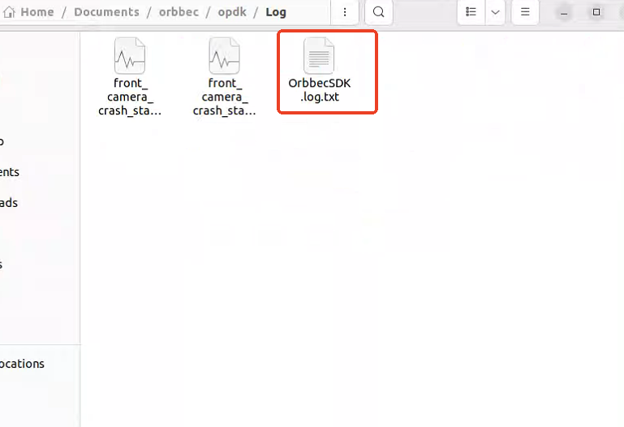

# OPDK

## Table of Contents

- [OPDK](#opdk)
  - [Table of Contents](#table-of-contents)
  - [Installation Instructions](#installation-instructions)
  - [Build Workspace](#build-workspace)
  - [Getting start](#getting-start)
  - [FAQ](#faq)

## Installation Instructions

Get source code

```bash
cd /home/orbbec/Documents/orbbec
git clone git@github.com:orbbec/opdk.git
git submodule update --init --recursive
```

Install deb dependencies

```bash
sudo apt-get install git-lfs
git lfs install --skip-repo

sudo apt install vpi3-dev libnvvpi3 ros-humble-isaac-ros-nitros \
ros-humble-isaac-ros-managed-nitros ros-humble-isaac-ros-nitros-image-type \
ros-humble-isaac-ros-nitros-camera-info-type -y
sudo apt install libbenchmark-dev ros-humble-foxglove-bridge ros-humble-nav2-costmap-2d libgoogle-glog-dev -y

sudo apt install libgflags-dev nlohmann-json3-dev \
ros-humble-image-transport ros-humble-image-publisher ros-humble-camera-info-manager \
ros-humble-diagnostic-updater ros-humble-diagnostic-msgs ros-humble-statistics-msgs \
ros-humble-backward-ros libdw-dev ros-humble-image-transport \
ros-humble-image-transport-plugins ros-humble-compressed-image-transport \
ros-humble-rqt-tf-tree -y
sudo apt install ros-humble-rqt-image-view ros-humble-rviz2 clang-format -y
```

Install udev rules.

```bash
cd /home/orbbec/Documents/orbbec/opdk/src/OrbbecSDK_ROS2/orbbec_camera/scripts
sudo bash install_udev_rules.sh
sudo udevadm control --reload-rules && sudo udevadm trigger
```

## Build Workspace

```bash
cd /home/orbbec/Documents/orbbec/opdk
colcon build --packages-skip nvblox_test_data nvblox_test --event-handlers  console_direct+  --cmake-args  -DCMAKE_BUILD_TYPE=Release
```

## Getting start

- Run all opdk nodes

```bash
cd /home/orbbec/Documents/orbbec/opdk
source install/setup.bash
ros2 launch isaac_orbbec_launch orbbec_perceptor.launch.py dev_matrices:=config/dev_matrices_SN1423724335594.yaml
```

**Another step-by-step execution method**

- Run static TF broadcast

```bash
cd /home/orbbec/Documents/orbbec/opdk/install/isaac_orbbec_launch/share/isaac_orbbec_launch/launch
python base_static_transforms_publisher.py --dev_matrices=/home/orbbec/Documents/orbbec/opdk/install/isaac_orbbec_launch/share/isaac_orbbec_launch/config/dev_matrices_SN1423724335594.yaml
```

- Run 4 cameras launch

```bash
cd /home/orbbec/Documents/orbbec/opdk
source install/setup.bash
ros2 launch orbbec_camera multi_camera_synced.launch.py
```

- Run Nvblox and cuVSLAM

```bash
cd /home/orbbec/Documents/orbbec/opdk
source install/setup.bash
ros2 launch isaac_ros_perceptor_bringup rgbd_perceptor.launch.py config_file:=/home/orbbec/Documents/orbbec/opdk/install/isaac_orbbec_launch/share/isaac_orbbec_launch/param/orbbec_perceptor_detached.yaml
```

- Run cuVSLAM without Nvblox

```bash
cd /home/orbbec/Documents/orbbec/opdk
source install/setup.bash
ros2 launch isaac_ros_perceptor_bringup rgbd_perceptor.launch.py config_file:=/home/orbbec/Documents/orbbec/opdk/install/isaac_orbbec_launch/share/isaac_orbbec_launch/param/orbbec_perceptor_detached.yaml disable_nvblox:=true
```


- Visualize the TF frame hierarchy using rqt_tf_tree with forced discovery.

```bash
ros2 run rqt_tf_tree rqt_tf_tree --force-discover
```

- View the output Pose from cuVSLAM, which is of type nav_msgs/msg/Odometry.

```bash
cd /home/orbbec/Documents/orbbec/opdk
source install/setup.bash
ros2 topic echo /visual_slam/tracking/odometry --no-arr
```

## FAQ

1. How to check the SN number of Orin device?

Answer: `cat /sys/firmware/devicetree/base/serial-number`

2. How to check the USB port number and SN number of the camera?

Answer: `ros2 run orbbec_camera list_devices_node`

3. How to switch the camera external parameter file when starting launch?

Answer: `ros2 launch isaac_orbbec_launch orbbec_perceptor.launch.py dev_matrices:=config/dev_matrices_SN1423724335594.yaml`

Replace `dev_matrices_SN1423724335594.yaml` with the external reference yaml file of the current device.

For example, `ros2 launch isaac_orbbec_launch orbbec_perceptor.launch.py dev_matrices:=config/dev_matrices_SN1423624327954.yaml`

4. How does the camera use specific camera parameter configuration yaml files?

Answer: For example, if you want to run the configuration of cuvslam+nvblox 640*360 60fps, open `multi_camera_synced.launch.py` and replace `camera_params.yaml` with `camera_params_cuvslam_nvblox-640_360_60fps.yaml`


5. How to determine the topic frame rate?

Answer：For example, if you want to check the frame rate of the depth stream of left_camera: `ros2 topic hz /left_camera/depth/image_raw`

6. Nvblox topic content judgment

[Isaac ROS Nvblox Topics and Services](https://nvidia-isaac-ros.github.io/v/release-3.2/repositories_and_packages/isaac_ros_nvblox/isaac_ros_nvblox/api/topics_and_services.html)

Answer：

`/nvblox_node/color_layer`：Pointcloud visualizing color voxels.


`/nvblox_node/dynamic_occupancy_layer`：A pointcloud of the people/dynamic occupancy map (only voxels with occupation probability > 0.5).

`/nvblox_node/combined_esdf_pointcloud`：A pointcloud of the combined static and people/dynamic 2D ESDF (minimal distance of both), with intensity as the metric distance to the nearest obstacle or person.


Effect of subscribing to two topics at the same time：


7. VSLAM content judgment

[Isaac ROS Visual SLAM](https://nvidia-isaac-ros.github.io/v/release-3.2/repositories_and_packages/isaac_ros_visual_slam/isaac_ros_visual_slam/index.html#quickstart)

Answer：The normal operation of VSLAM mainly depends on whether the odom data is updated normally:

`ros2 topic echo /visual_slam/tracking/odometry`

8. OrbbecSDK log storage and analysis

Answer：Modify `OrbbecSDKConfig_v2.0.xml` in the OrbbecSDK_ROS2 package and change FileLogLevel to 0


Then recompile and start the camera, and you can see the camera log file `OrbbecSDK.log.txt` in the Log folder in the opdk folder


