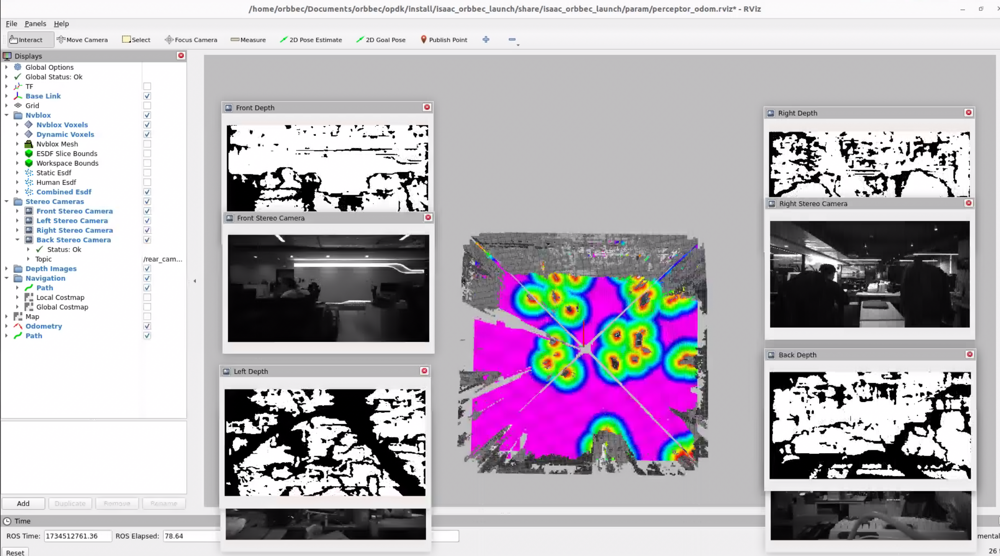

# OPDK

## Table of Contents

- [OPDK](#opdk)
  - [Table of Contents](#table-of-contents)
  - [Installation Instructions](#installation-instructions)
  - [Getting start](#getting-start)

## Installation Instructions

Get source code

```bash
cd /home/orbbec/Documents/orbbec
git clone git@github.com:orbbec/opdk.git
git submodule update --init --recursive
```

Install deb dependencies

```bash
sudo apt-get install git-lfs
git lfs install --skip-repo

sudo apt install vpi3-dev libnvvpi3 ros-humble-isaac-ros-nitros \
ros-humble-isaac-ros-managed-nitros ros-humble-isaac-ros-nitros-image-type \
ros-humble-isaac-ros-nitros-camera-info-type -y
sudo apt install libbenchmark-dev ros-humble-foxglove-bridge ros-humble-nav2-costmap-2d libgoogle-glog-dev -y

sudo apt install libgflags-dev nlohmann-json3-dev \
ros-humble-image-transport ros-humble-image-publisher ros-humble-camera-info-manager \
ros-humble-diagnostic-updater ros-humble-diagnostic-msgs ros-humble-statistics-msgs \
ros-humble-backward-ros libdw-dev ros-humble-image-transport \
ros-humble-image-transport-plugins ros-humble-compressed-image-transport \
ros-humble-rqt-tf-tree -y
sudo apt install ros-humble-rqt-image-view ros-humble-rviz2 clang-format -y
```

Install udev rules.

```bash
cd /home/orbbec/Documents/orbbec/opdk/src/OrbbecSDK_ROS2/orbbec_camera/scripts
sudo bash install_udev_rules.sh
sudo udevadm control --reload-rules && sudo udevadm trigger
```

## Build Workspace

```bash
cd /home/orbbec/Documents/orbbec/opdk
colcon build --packages-skip nvblox_test_data nvblox_test --event-handlers  console_direct+  --cmake-args  -DCMAKE_BUILD_TYPE=Release
```

## Getting start
Launch node

- On terminal 1, run all opdk nodes

```bash
cd /home/orbbec/Documents/orbbec/opdk
source install/setup.bash
ros2 launch isaac_orbbec_launch orbbec_perceptor.launch.py
```



- On terminal 2, visualize the TF frame hierarchy using rqt_tf_tree with forced discovery.

```bash
ros2 run rqt_tf_tree rqt_tf_tree --force-discover
```

- On terminal 3, view the output Pose from cuVSLAM, which is of type nav_msgs/msg/Odometry.

```bash
cd /home/orbbec/Documents/orbbec/opdk
source install/setup.bash
ros2 topic echo /visual_slam/tracking/odometry --no-arr
```
